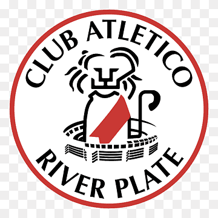
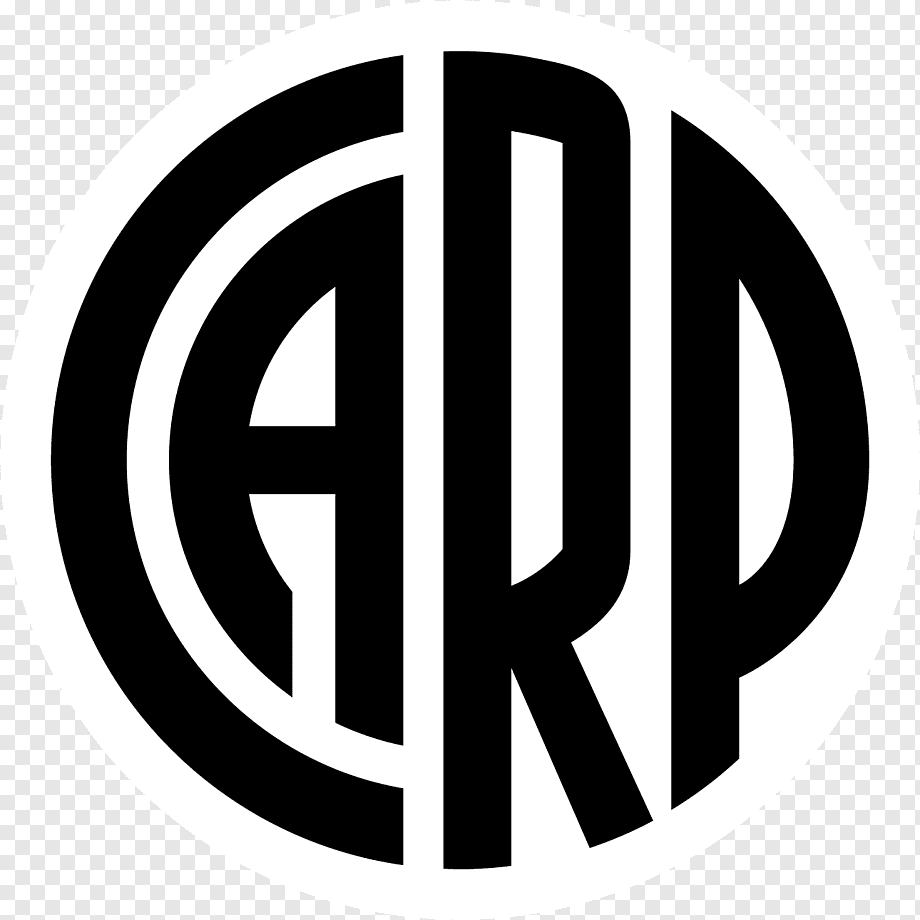

<!doctype html>
<html lang="es">
    <head>
        <meta charset="utf-8" />
        <title>Escudo de River Plate</title>
    </head>
    <body>
        
Grandeza

 

         
    </body>
</html>
